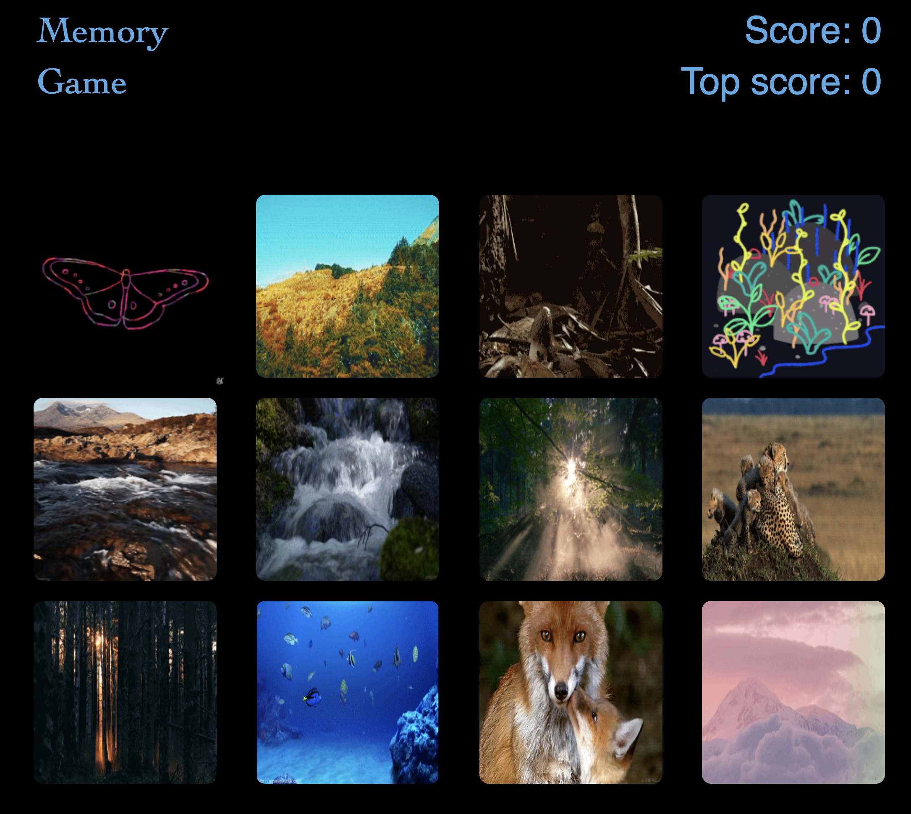

# :link: Me on GitHub
* My [profile](https://github.com/Arsalan-Sadri)
  * All repositories, source codes, READMEs, pull requests, commits, issues, and...
* My [portfolio](https://Arsalan-Sadri.github.io)
  * Find all deployed applications 

# :page_with_curl: Description
* A memory game.
* The application keeps track of the user's score. 
* Every time an image is clicked, the images rendered to the page shuffle themselves in a random order. 
* The user's score gets incremented when clicking an image for the first time.
* The user's score get reset to 0 if they click the same image more than once.
* Once the user's score is reset after an incorrect guess, the game restarts.
* Images are pulled over from `GIPHY API`

# :nut_and_bolt: Tools and Technologies
* Languages, libraries, and frameworks: `HTML`, `CSS`, `JavaScript`
* Dependencies: `axios`, `react`, `react-dom`, `react-scripts`, `gh-pages`
* API: `GIPHY API`
* Package Manager: `npm`
* Version control: `Git`
* Editor: `Visual Studio Code`
* Operating System: `Mac OS`

# :arrow_forward: Deployed Application
* See the [application](https://arsalan-sadri.github.io/18_ReactClickyGame/) up and running via GitHub Pages directly from its depository 

# :tv: Demo
* [Here]() see a short demo of this application on my YouTube channel!

# :wrench: How to Run
In order to run the application on your device, follow the instructions given below:
1. **Clone down** the application to your local device
   1. Click on the green button above "Clone or download"
   2. ...
2. **Install the packages** specified in `package.json`
   1. `$ npm i`
3. `$ yarn start`

# :key: Technical Highlights
1. ...